<Note>
  Text messages can only be sent within the 24-hour messaging window after a customer initiates contact.
</Note>

## Overview

Send plain text WhatsApp messages to your customers. This is ideal for quick responses, customer support conversations, and follow-up messages within an active chat session.

## 24-Hour Messaging Window

<Warning>
  WhatsApp only allows free-form text messages within 24 hours of the customer's last message. After this window closes, you must use a [template message](/api-reference/endpoint/send-template) to re-engage.

```mermaid
sequenceDiagram
    participant Customer
    participant Your App
    participant WhatsApp
    
    Customer->>WhatsApp: Sends message
    WhatsApp->>Your App: Webhook notification
    Note over Your App: 24-hour window opens
    Your App->>WhatsApp: Send text message ✅
    Your App->>WhatsApp: Send text message ✅
    Note over Your App: After 24 hours...
    Your App->>WhatsApp: Send text message ❌
    Your App->>WhatsApp: Send template message ✅
```

</Warning>



## Request Body

| Field | Type | Required | Description |
|-------|------|----------|-------------|
| `to` | string | Yes | Recipient's phone number with country code |
| `from` | string | Yes | Your WhatsApp Business phone number |
| `text` | string | Yes | The message content (max 4096 characters) |

## Example Request

<CodeGroup>

```bash cURL
curl -X POST https://api.meseji.app/api/v1/whatsapp/messages/text \
  -H "Authorization: Bearer YOUR_API_TOKEN" \
  -H "Content-Type: application/json" \
  -d '{
    "to": "919876543210",
    "from": "919123456789",
    "text": "Hello! Thanks for reaching out. How can I help you today?"
  }'
```

```javascript JavaScript
const response = await fetch('https://api.meseji.app/api/v1/whatsapp/messages/text', {
  method: 'POST',
  headers: {
    'Authorization': 'Bearer YOUR_API_TOKEN',
    'Content-Type': 'application/json'
  },
  body: JSON.stringify({
    to: '919876543210',
    from: '919123456789',
    text: 'Hello! Thanks for reaching out. How can I help you today?'
  })
});

const data = await response.json();
console.log(data);
```

```python Python
import requests

url = "https://api.meseji.app/api/v1/whatsapp/messages/text"
headers = {
    "Authorization": "Bearer YOUR_API_TOKEN",
    "Content-Type": "application/json"
}
payload = {
    "to": "919876543210",
    "from": "919123456789",
    "text": "Hello! Thanks for reaching out. How can I help you today?"
}

response = requests.post(url, json=payload, headers=headers)
print(response.json())
```

```php PHP
<?php
$curl = curl_init();

curl_setopt_array($curl, [
    CURLOPT_URL => "https://api.meseji.app/api/v1/whatsapp/messages/text",
    CURLOPT_RETURNTRANSFER => true,
    CURLOPT_POST => true,
    CURLOPT_HTTPHEADER => [
        "Authorization: Bearer YOUR_API_TOKEN",
        "Content-Type: application/json"
    ],
    CURLOPT_POSTFIELDS => json_encode([
        "to" => "919876543210",
        "from" => "919123456789",
        "text" => "Hello! Thanks for reaching out. How can I help you today?"
    ])
]);

$response = curl_exec($curl);
curl_close($curl);

echo $response;
?>
```

</CodeGroup>

## Success Response

```json
{
  "status": true,
  "message": "Message sent successfully"
}
```

## Text Formatting

WhatsApp supports basic text formatting in messages:

| Format | Syntax | Example |
|--------|--------|---------|
| **Bold** | `*text*` | `*Hello*` → **Hello** |
| *Italic* | `_text_` | `_Hello_` → *Hello* |
| ~~Strikethrough~~ | `~text~` | `~Hello~` → ~~Hello~~ |
| `Monospace` | ``` `text` ``` | `` `Hello` `` → `Hello` |

### Example with Formatting

```json
{
  "to": "919876543210",
  "from": "919123456789",
  "text": "Hi *John*! 👋\n\nYour order _#12345_ has been confirmed.\n\nTotal: `$99.99`\n\nThank you for shopping with us!"
}
```

<Tip>
  Use `\n` for line breaks in your message to improve readability.
</Tip>

## Best Practices

<CardGroup cols={2}>
  <Card title="Keep it Concise" icon="compress">
    Short, clear messages have higher engagement rates
  </Card>
  <Card title="Use Emojis" icon="face-smile">
    Emojis make messages feel friendly and personal
  </Card>
  <Card title="Respond Quickly" icon="clock">
    Reply within the 24-hour window to maintain conversation
  </Card>
  <Card title="Personalize" icon="user">
    Include customer name and relevant details
  </Card>
</CardGroup>
