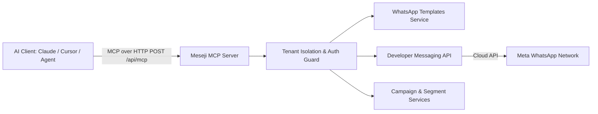

The **Meseji MCP Server** exposes enterprise WhatsApp Business API capabilities as standardized tools using Anthropic's open-source **Model Context Protocol (MCP)**.

With Meseji's MCP server, your AI assistants and autonomous agents can manage WhatsApp communications using natural language—while maintaining strict multi-tenant isolation, template validation, and permission boundaries.

<CardGroup cols={2}>
  <Card title="Direct Messaging" icon="message-dots">
    Send text messages inside active 24-hour service windows and dispatch pre-approved Meta templates.
  </Card>

  <Card title="Template Management" icon="newspaper">
    Inspect existing templates, check approval statuses, and draft new marketing or utility templates for Meta review.
  </Card>

  <Card title="Audience Segments" icon="users-viewfinder">
    Query live customer segments and audience sizes directly from your conversation.
  </Card>

  <Card title="Campaign Drafting" icon="bullhorn">
    Create broadcast campaigns safely in `DRAFT` state for human review before launch.
  </Card>
</CardGroup>

---

## Why Use MCP for WhatsApp Business?

<AccordionGroup>
  <Accordion title="1. High-Precision Template Parameter Mapping">
    Meta WhatsApp Cloud API rejects template sends with opaque errors if placeholders or media URLs do not match exactly. Meseji's MCP server introspects template variables (header media, body placeholders, dynamic URL buttons) and instructs the model with the exact schema needed.
  </Accordion>

  <Accordion title="2. Safety Guardrails & Human-in-the-Loop">
    Tools that trigger outbound customer messages or submit templates are marked with `destructiveHint: true`. Broadcast campaigns are created in `DRAFT` state to prevent accidental mass sends. OTP/Authentication templates are blocked from AI trigger paths to protect verification integrity.
  </Accordion>

  <Accordion title="3. Universal Client Support">
    Built on standard **Streamable HTTP** (`POST /api/mcp`), supporting **API Key authentication** and **RFC 7591 / RFC 9728 OAuth 2.0 PKCE dynamic client discovery**. Works out of the box with Claude Desktop, Cursor, Claude Code, Windsurf, VS Code, and LangChain/LlamaIndex agents.
  </Accordion>
</AccordionGroup>

---

## Quick Architecture

